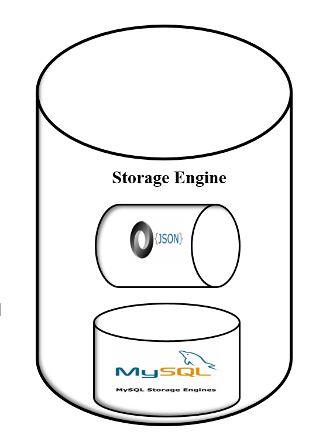

* The primary objective of a data storage engine is to efficiently and effectively store,
manage, and retrieve data in a way that meets the needs of the application or system that
it supports ```client```.


